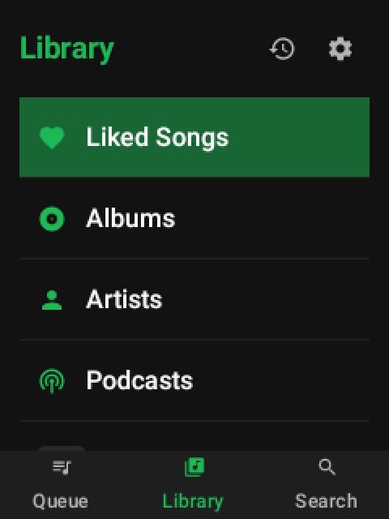
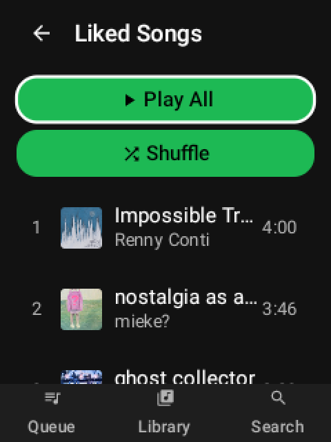
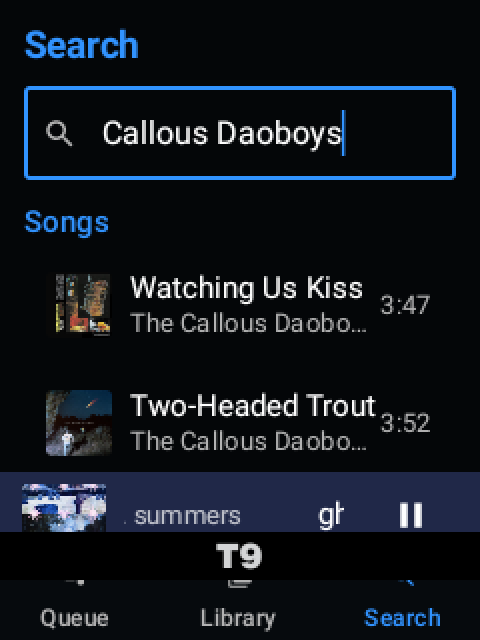
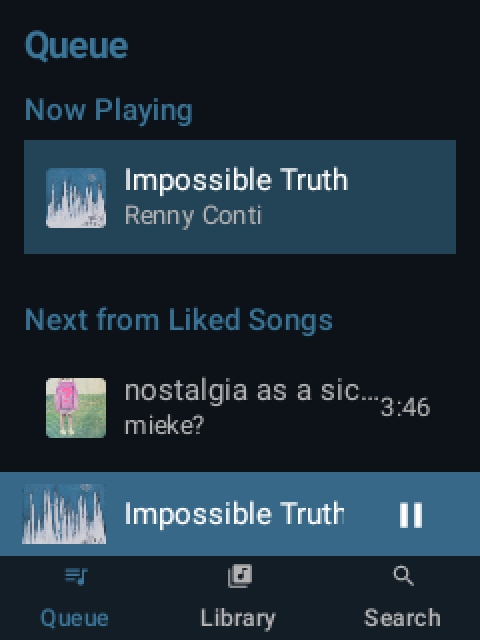
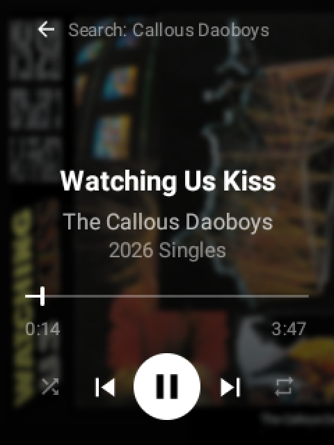

# Sidetrack

A lightweight, GMS-free Spotify client built for D-pad-only feature phones and flip phones running Android -- no touchscreen required.

Built on [librespot](https://github.com/librespot-org/librespot) (Rust) with a minimal [Jetpack Compose](https://developer.android.com/jetpack/compose) UI.

## Credit

Sidetrack is a fork of [Sidespot](https://github.com/jtaekman/sidespot) by [@jtaekman](https://github.com/jtaekman), originally built for the [Sidephone SP-01](https://sidephone.com) and its rotary Sundial keypad. Sidetrack retargets that same librespot/Compose foundation at D-pad-and-keypad flip and feature phones instead -- none of this would exist without jtaekman's original work on the JNI bridge, the Compose UI, and the Spotify integration itself.

## Screenshots

<p align="center">
  
  
  
  
  
</p>

## Features

- **No Google Play Services required** -- runs on degoogled and minimal Android devices
- **Optimized for small screens** -- dark theme, designed for tiny flip-phone displays
- **D-pad only** -- every screen, including seeking and shuffle/repeat, is reachable without a touchscreen
- **Full playback** -- play, pause, seek, skip, shuffle, repeat, queue management
- **Spotify Connect pairing** -- pairs with the official Spotify app (phone or desktop) over Wi-Fi via Zeroconf, no browser or manual login needed
- **Library browsing** -- playlists, liked songs, saved albums, followed artists, saved podcasts, sorted by recently played with album art thumbnails
- **Library management** -- save/remove albums, playlists, and podcasts directly from the app; add tracks to liked songs or any writable playlist; create new playlists
- **Search** -- find tracks, artists, albums, playlists, and podcasts
- **Artist pages** -- browse followed artists, view an artist's popular tracks, and jump straight to the artist from any track
- **Podcast support** -- browse saved shows, view episode lists, play episodes, dedicated New Episodes screen across all subscribed shows
- **Background playback** -- foreground service with media notification controls
- **Dynamic theming** -- album art colors tint the entire UI with smooth animated transitions
- **Hardware volume keys** -- physical button integration
- **Audio focus** -- pauses for calls, ducks for notifications, resumes automatically
- **Play history** -- dedicated History view combining local listening history with your official Spotify history (note: playback through Sidetrack does not appear in your official Spotify history)
- **E-ink display mode** -- high-contrast monochrome UI optimized for e-ink screens
- **Settings** -- audio quality (160/320 kbps), volume normalization, gapless playback, autoplay, e-ink mode, key mapping

## Supported Devices

Confirmed working:

- **TCL Flip 2 / Gflip6** (tested on this fork)

Expected to work -- same class of D-pad/keypad-only Android hardware, not yet confirmed by us:

- Qin F22 Pro
- Mode 1 Retro II
- Cat S22 Flip
- Sonim XP3 Plus
- Kyocera DuraXV Extreme

Different OEMs map their physical soft keys to different Android keycodes, so out-of-the-box behavior can vary by device. **Settings > Key Mapping** lets you press each physical button and record what it should do, so the app can adapt to whatever your specific hardware sends instead of assuming everyone matches the TCL layout. If you get Sidetrack running on hardware not listed here, open an issue (or a PR) with what worked.

## Controls

D-pad navigation, no touchscreen needed. Defaults below -- remap any of them in **Settings > Key Mapping**.

| Control | Action |
|---------|--------|
| **D-pad up / down** | Scroll lists and menus |
| **D-pad left / right** | Focus traversal in lists; skip previous/next on Now Playing |
| **D-pad center** | Select focused item; Play/Pause on Now Playing; long-press for row actions |
| **D-pad up on Now Playing** | Enter seek mode (left/right then scrub instead of skipping) |
| **D-pad down on Now Playing** | Exit seek mode, back to normal skip controls |
| **Long-press D-pad left / right on Now Playing** | Toggle shuffle / cycle repeat |
| **Soft-left key / \*** | Cycle tabs (Queue / Library / Search) |
| **Soft-right key / Tab / #** | Show / hide Now Playing |
| **Menu key** | Open row actions (add to queue, liked songs, playlist) |
| **Volume up / down** | Always adjusts volume, on any screen |
| **Media play/pause/next/previous keys** | Control playback globally |

Additional adaptations for D-pad use:
- **Fill-style focus indicators** on all interactive items
- **Stacked Play All / Shuffle buttons** in playlist and album views for easy D-pad access
- **Auto-focus on first content row** when entering any list view
- **Focus only appears during D-pad use** -- hidden in touch mode to avoid visual clutter

## Requirements

- Spotify Premium account
- Android 12+ (API 31+), ARM device (arm64-v8a or armeabi-v7a)

## Install

### From Releases

Download the latest APK from [Releases](https://github.com/qfertig/sidetrack/releases) and sideload it onto your device:

```sh
adb install sidetrack-v*.apk
```

### From Obtainium

To track updates automatically via [Obtainium](https://github.com/ImranR98/Obtainium):

1. Open Obtainium
2. Add app -> enter the repository URL: `https://github.com/qfertig/sidetrack`
3. Obtainium will check for new releases and notify you when updates are available

## Build from Source

### Prerequisites

- **Java 17** (e.g. `brew install openjdk@17`)
- **Android SDK** (API 34) with NDK `27.0.12077973`
- **Rust toolchain** with `aarch64-linux-android` and `armv7-linux-androideabi` targets
- **[cargo-ndk](https://github.com/nicegram/aspect-cargo-ndk)** (`cargo install cargo-ndk`)

### Setup

```sh
# Install Rust Android targets
rustup target add aarch64-linux-android armv7-linux-androideabi

# Clone with submodules (librespot)
git clone --recurse-submodules https://github.com/qfertig/sidetrack.git
cd sidetrack
```

### Build & Install

The Gradle build automatically compiles the Rust native library via `cargo-ndk` before assembling the APK.

```sh
# Debug build + install to connected device
export JAVA_HOME=$(brew --prefix openjdk@17)/libexec/openjdk.jdk/Contents/Home
./gradlew installDebug

# Release APK (requires signing config in release-keystore.properties)
./gradlew assembleRelease
```

The release APK will be at `app/build/outputs/apk/release/app-release.apk`.

### Release Signing

To build a signed release APK, create `release-keystore.properties` in the project root:

```properties
storeFile=path/to/your/keystore.jks
storePassword=your-store-password
keyAlias=your-key-alias
keyPassword=your-key-password
```

## Architecture

```
┌─────────────────────────────┐
│   Jetpack Compose UI        │  Kotlin / MVVM
│   (Library, Search, Player) │
├─────────────────────────────┤
│   JNI Bridge                │  Kotlin external fun <-> Rust extern "C"
├─────────────────────────────┤
│   librespot (Rust)          │  Session, playback, metadata, audio decoding
│   + Tokio async runtime     │
└─────────────────────────────┘
```

- **Native core**: librespot handles Spotify protocol, authentication, audio streaming, and decryption
- **JNI bridge**: Serializes data as JSON between Kotlin and Rust
- **Audio pipeline**: librespot decodes OGG Vorbis to PCM, delivers samples via JNI callback to Android AudioTrack
- **UI**: Jetpack Compose with Navigation, Material3, Coil for album art

## Current Limitations

- **Spotify Premium required** -- free-tier accounts are not supported by librespot
- **ARM only** -- the native library is built for `arm64-v8a` and `armeabi-v7a`
- **No lossless/HiFi** -- max quality is 320 kbps OGG Vorbis. Spotify's lossless tier uses DRM that librespot cannot and will not circumvent
- **Spotify Connect (receive-only)** -- pairs via Zeroconf so the official Spotify app can hand off playback to it, but it doesn't advertise/control other Connect targets itself
- **No crossfade** -- crossfade between tracks is not supported
- **No offline mode** -- streaming only, no download/cache for offline listening
- **Account risk** -- Spotify has not sanctioned third-party clients. Use at your own risk

## Disclaimer

Sidetrack is not affiliated with or endorsed by Spotify. It uses a reverse-engineered protocol implementation ([librespot](https://github.com/librespot-org/librespot)). Use at your own risk. A Spotify Premium subscription is required.

## License

GPLv3. See [LICENSE](LICENSE) for details.
